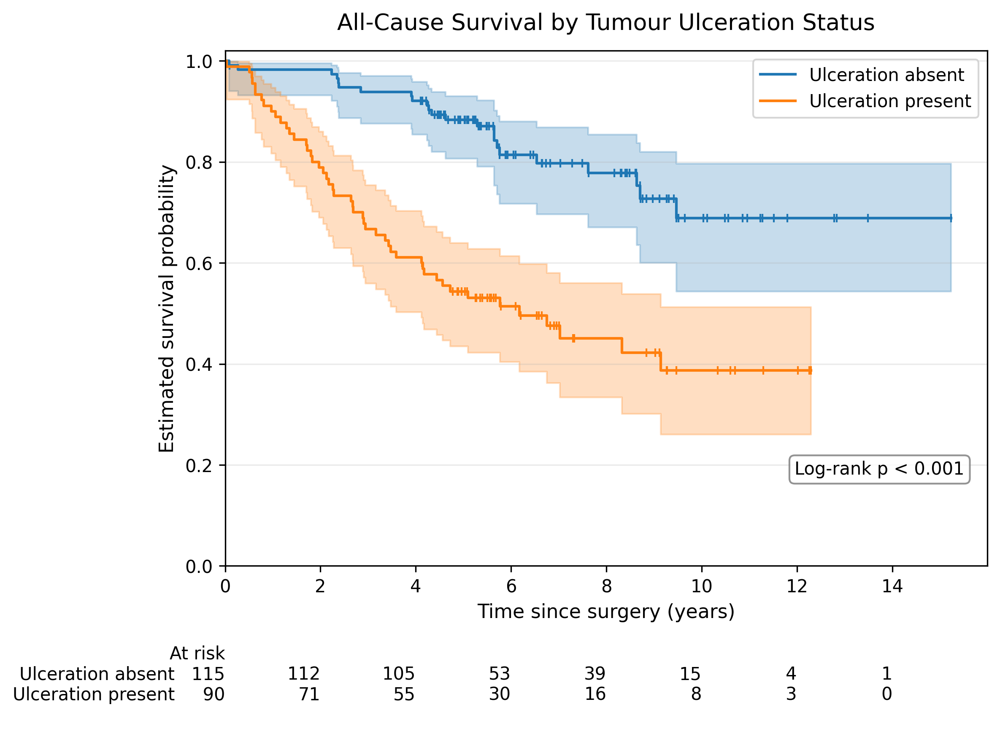
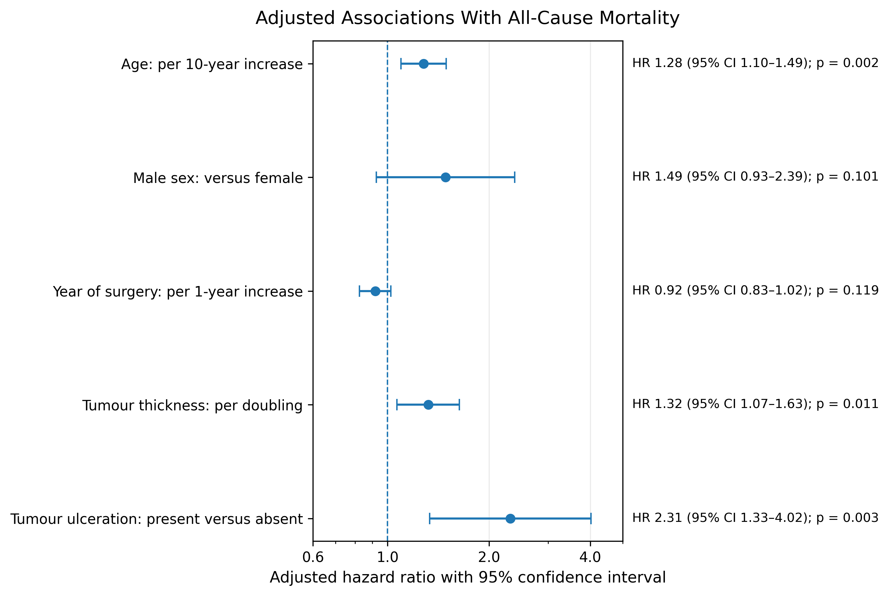
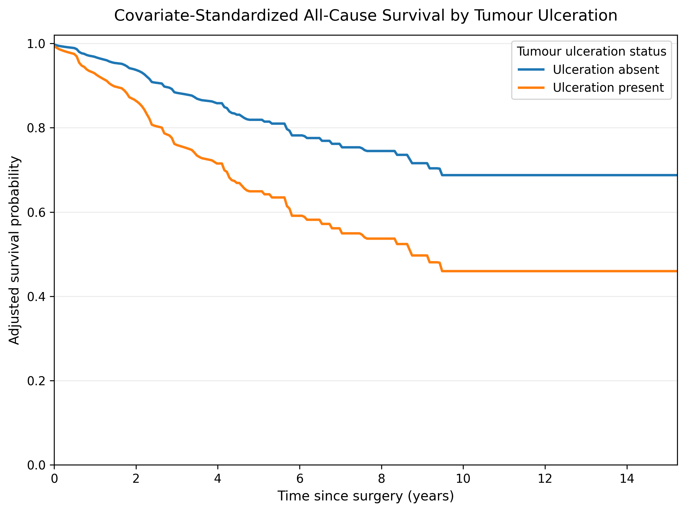
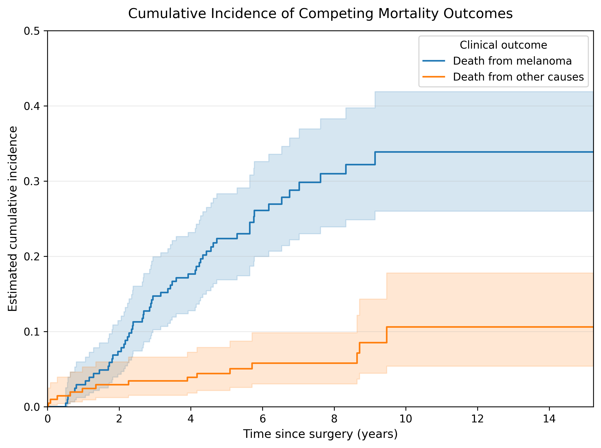
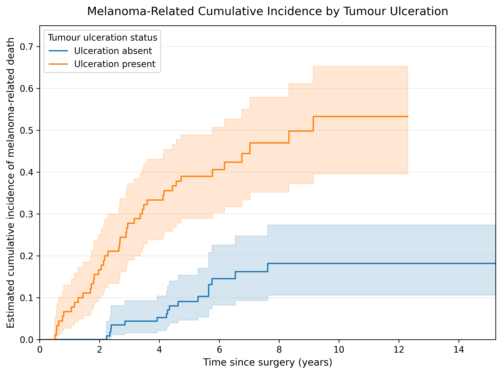
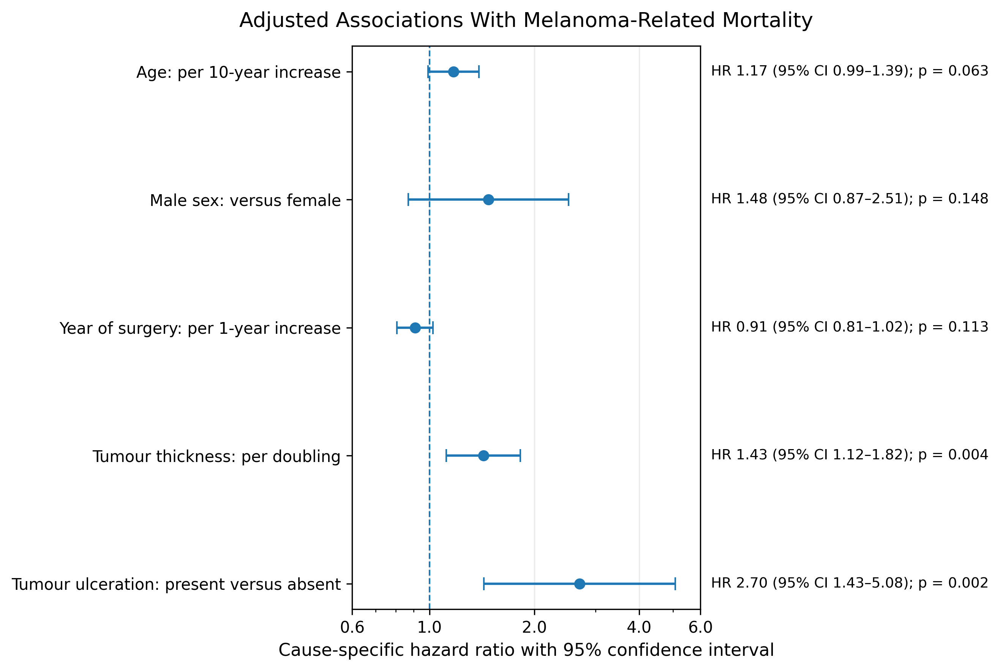
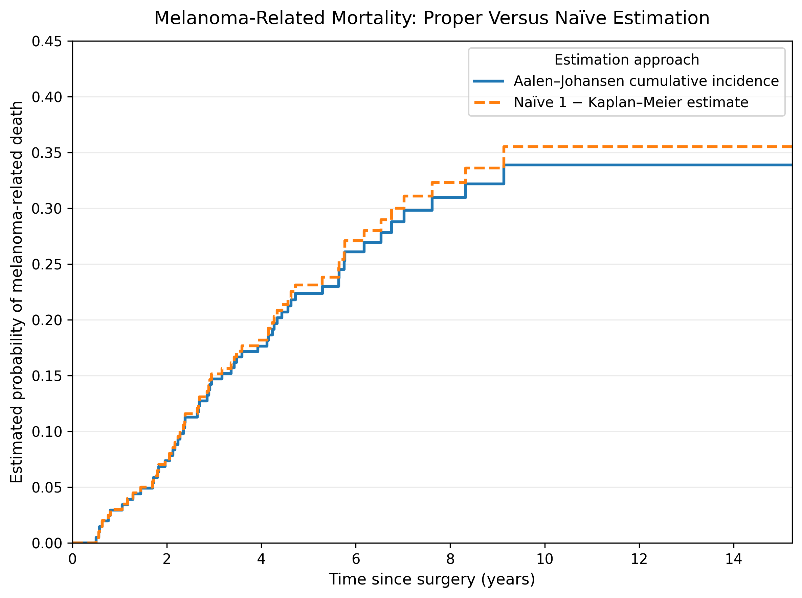

# Survival and Competing-Risk Analysis for Clinical Research

## Clinical Melanoma Prognosis After Surgical Treatment

A reproducible Python workflow for clinical time-to-event analysis, Cox proportional-hazards modeling, competing-risk estimation, diagnostic assessment, and cautious interpretation.

This project demonstrates how conventional survival analysis and competing-risk methods answer related but distinct clinical questions using publicly available malignant melanoma follow-up data.

---

## Project Overview

The analysis evaluates survival outcomes after surgical treatment for malignant melanoma.

Two connected clinical questions are addressed:

1. **Which patient and tumour characteristics are associated with all-cause mortality after surgery?**
2. **How does the cumulative incidence of melanoma-related death differ from death due to other causes, particularly according to tumour ulceration status?**

The workflow includes both conventional survival methods and competing-risk approaches so that all-cause survival, melanoma-specific mortality probability, and cause-specific hazards are interpreted appropriately rather than interchangeably.

---

## Public Clinical Dataset

The project uses the publicly available `melanoma` dataset from the R `boot` package.

The dataset contains **205 patients** who underwent surgical removal of malignant melanoma.

Available variables include:

* follow-up time after surgery,
* final follow-up outcome,
* patient sex,
* age at surgery,
* year of surgery,
* tumour thickness,
* and tumour ulceration status.

The outcome variable distinguishes:

* death from melanoma,
* alive at the end of follow-up,
* and death from another cause.

This structure makes the dataset suitable for both conventional survival analysis and competing-risk modeling.

---

## Analytical Workflow

The notebook includes:

1. data acquisition and integrity checks,
2. censoring and follow-up assessment,
3. Kaplan–Meier all-cause survival estimation,
4. log-rank comparison by tumour ulceration status,
5. multivariable Cox proportional-hazards modeling,
6. Schoenfeld-residual proportional-hazards diagnostics,
7. exploratory time-varying sensitivity analysis,
8. covariate-standardized adjusted survival curves,
9. Aalen–Johansen competing-risk estimation,
10. melanoma-related cumulative-incidence analysis,
11. cause-specific Cox modeling for melanoma-related death,
12. proportional-hazards diagnostics for the cause-specific model,
13. and comparison with a naïve Kaplan–Meier approach that treats competing deaths as ordinary censoring.

---

## Key Findings

### All-Cause Survival

Kaplan–Meier estimates showed substantial unadjusted survival differences by tumour ulceration status.

At **5 years** after surgery:

* survival was **88.3%** among patients without tumour ulceration,
* survival was **54.3%** among patients with tumour ulceration.

The log-rank comparison indicated strong evidence of different survival distributions: **p < 0.001**.

### Adjusted All-Cause Mortality

In the primary Cox model:

* each 10-year increase in age was associated with a higher all-cause mortality hazard
  **HR = 1.28**, 95% CI: **1.10–1.49**;
* each doubling of tumour thickness was associated with a higher all-cause mortality hazard
  **HR = 1.32**, 95% CI: **1.07–1.63**;
* tumour ulceration was associated with a substantially higher all-cause mortality hazard
  **HR = 2.32**, 95% CI: **1.33–4.02**.

The model concordance index was **0.740**.

### Competing-Risk Analysis

At **10 years** after surgery, the Aalen–Johansen cumulative-incidence estimates were:

* **33.9%** for melanoma-related death,
* **10.6%** for death from other causes.

Tumour ulceration was associated with a pronounced descriptive difference in melanoma-related cumulative incidence:

* **18.2%** without ulceration,
* **53.3%** with ulceration.

### Cause-Specific Melanoma Mortality

In the adjusted cause-specific Cox model:

* each doubling of tumour thickness was associated with a higher melanoma-death hazard
  **HR = 1.43**, 95% CI: **1.12–1.82**;
* tumour ulceration was associated with a substantially higher melanoma-death hazard
  **HR = 2.70**, 95% CI: **1.44–5.08**.

The cause-specific model concordance index was **0.768**.

---

## Selected Figures

### Kaplan–Meier Survival by Tumour Ulceration Status



### Adjusted All-Cause Hazard Ratios



### Covariate-Standardized Adjusted Survival Curves



### Overall Competing-Risk Cumulative Incidence



### Melanoma-Related Cumulative Incidence by Tumour Ulceration



### Cause-Specific Melanoma Mortality Hazard Ratios



### Proper Versus Naïve Estimation of Melanoma-Related Mortality



---

## Why the Competing-Risk Framework Matters

Death from another cause prevents a patient from later experiencing melanoma-related death.

Treating competing deaths as ordinary censored observations can therefore overestimate melanoma-related mortality.

At **10 years**:

* the appropriate Aalen–Johansen estimate was **33.9%**,
* the naïve `1 − Kaplan–Meier` estimate was **35.5%**.

The numerical difference was modest because only 14 competing deaths were observed. However, the comparison illustrates an important methodological principle: competing outcomes should be handled explicitly when estimating event-specific probabilities.

---

## Repository Structure

```text
survival-competing-risk-clinical-python
│
├── outputs
├── Survival_Competing_Risk_Clinical_Python.ipynb
└── README.md
```

The `outputs` folder contains:

* **29 analytical CSV tables**,
* **9 publication-style PNG figures**,
* and **1 repository-output manifest**.

---

## Interpretation Boundary

This is an observational prognostic analysis.

The estimated associations should not be interpreted as causal effects. Tumour thickness and ulceration are clinical characteristics rather than interventions.

The project demonstrates a rigorous and reproducible workflow for clinical survival analysis, competing-risk estimation, model diagnostics, cautious interpretation, and transparent reporting. It is not a deployable clinical prediction model and has not been externally validated in an independent cohort.

---

## Technical Environment

The notebook was developed in Google Colab using Python and the following core libraries:

* `pandas`
* `NumPy`
* `Matplotlib`
* `statsmodels`
* `lifelines`

The final notebook was restarted and executed from beginning to end in a clean Colab session. The repository audit confirmed that all planned analytical outputs were regenerated successfully with no missing or unexpected files.

---

## Author

**Dr. Imran Sarmad**
*PhD Statistical Consultant | Clinical, RWE, HEOR/HTA, Causal Inference & Advanced Modeling*

Website: [drimransarmad.com](https://drimransarmad.com)

LinkedIn: [Dr. Imran Sarmad](https://www.linkedin.com/in/dr-imran-sarmad/)

